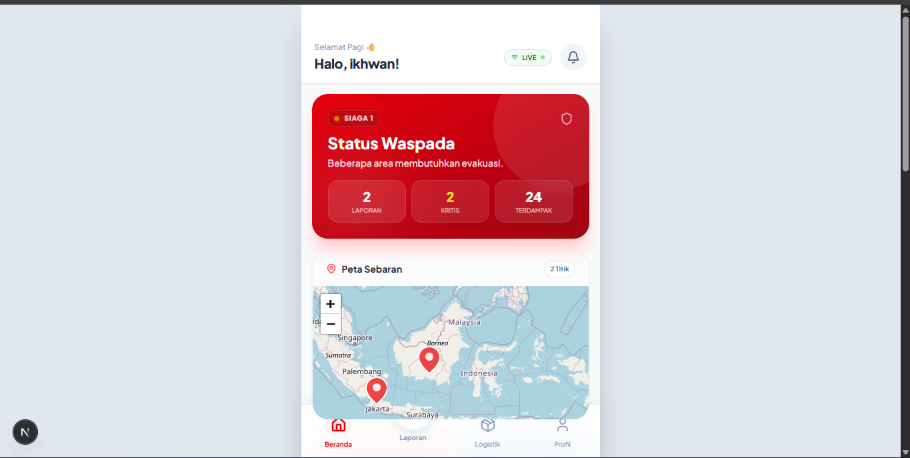
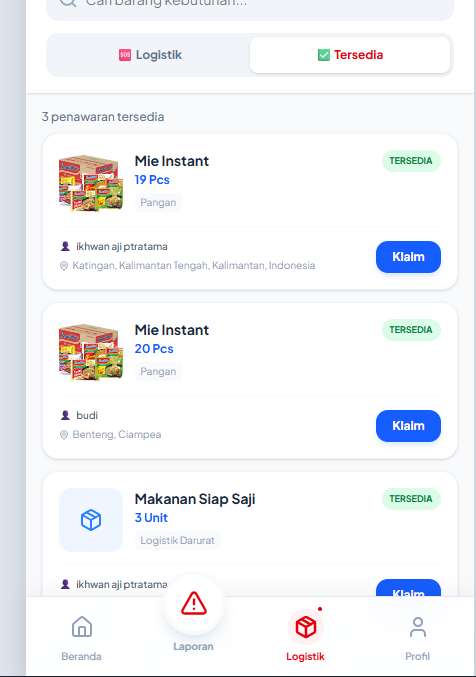
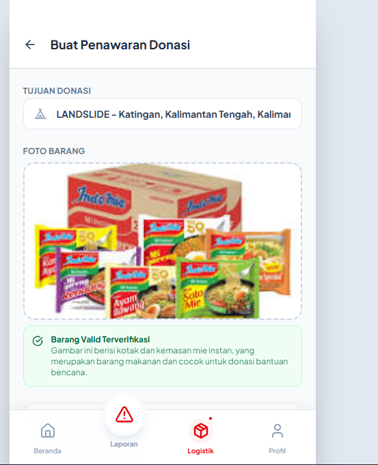
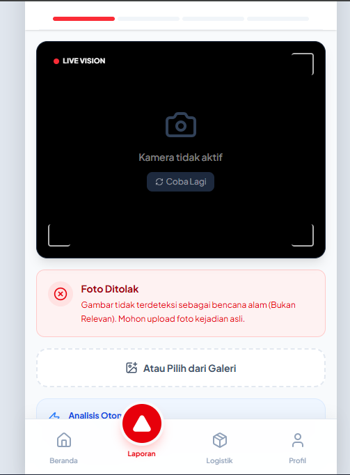
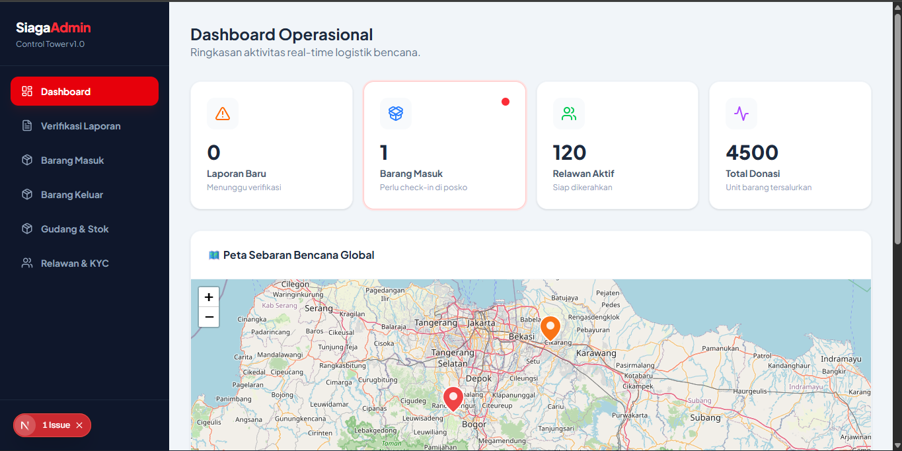
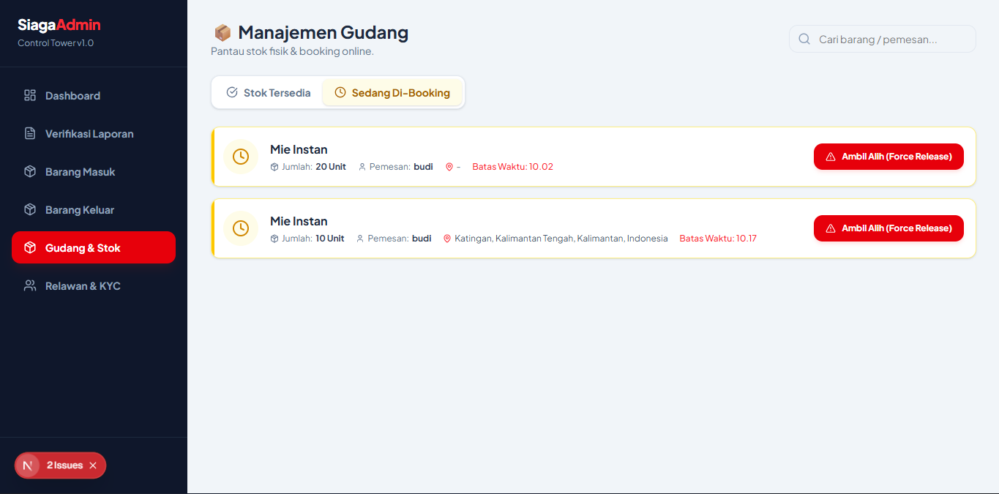
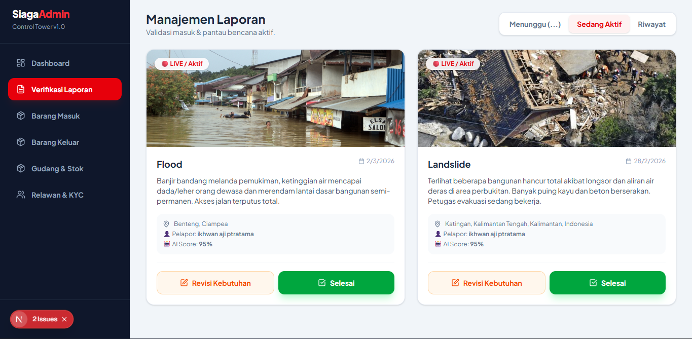

# 📦 Logistik Siaga - Disaster Logistics Command Center


**Logistik Siaga** adalah platform manajemen logistik bencana berbasis _crowdsourcing_ yang menghubungkan donatur, relawan, dan posko bencana secara _real-time_. Aplikasi ini bertujuan untuk mengatasi masalah klasik dalam logistik bencana: penumpukan barang yang tidak sesuai, distribusi yang tidak merata, dan kurangnya transparansi.

---

## 🌟 Fitur Utama

### 1. Dashboard Situasi Real-time
Halaman utama yang memberikan ringkasan status bencana terkini ("Siaga 1", "Waspada") beserta peta sebaran titik bencana.
* **Live Map:** Menggunakan Leaflet untuk memvisualisasikan lokasi bencana dan posko.
* **Quick Stats:** Informasi cepat mengenai jumlah laporan masuk dan area terdampak.



### 2. Marketplace Logistik (Supply & Demand)

- **Needs (Kebutuhan):** Posko dapat mempublikasikan kebutuhan mendesak (misal: "Butuh 50 Selimut").
- **Offers (Ketersediaan):** Donatur dapat menawarkan barang yang mereka miliki.
- **Real-time Progress:** Grafik batang yang menunjukkan pemenuhan kebutuhan secara langsung.



### 3. Smart Claiming System (Anti-Hoarding)

Sistem klaim cerdas untuk mencegah "prank" atau penimbunan digital:

- **Inventory Splitting:** Klaim parsial (misal: ambil 2 dari 10) tidak menghapus sisa stok dari etalase.
- **Time-Based Lock:** Barang yang dibooking memiliki timer (misal: 2 jam). Jika tidak diambil, stok kembali ke publik.
- **Manual Override:** Admin Posko memiliki Hak untuk membatalkan booking online jika ada kebutuhan mendesak di lokasi (_Walk-in Priority_).


### 3. AI-Powered Reporting

- **Computer Vision (Gemini AI):** Menganalisis foto bencana yang diunggah warga untuk mendeteksi jenis bencana, tingkat keparahan (_severity_), dan estimasi kebutuhan logistik secara otomatis.
- **Auto-Reject:** AI memfilter foto yang tidak relevan (selfie/spam) sebelum masuk ke sistem.





### 4. Admin Command Tower

- **Verifikasi Laporan:** Validasi laporan warga sebelum tampil di publik.
- **Manajemen Gudang:** Pantau stok fisik vs stok yang sedang di-booking.
- **Barang Keluar (Outgoing):** Verifikasi pengambilan barang menggunakan QR Code / Kode Transaksi.
- **Quality Check:** Fitur untuk menerima (Layak) atau menolak (Rusak/Basi) barang donasi yang masuk.






---

## 🛠️ Tech Stack

- **Framework:** [Next.js](https://nextjs.org/) (App Router)
- **Bahasa:** TypeScript
- **Styling:** Tailwind CSS
- **Database & Auth:** Google Firebase (Firestore & Authentication)
- **AI Model:** Google Gemini (via `@google/genai` SDK)
- **Maps:** Leaflet / OpenStreetMap
- **UI Components:** Lucide React, Sonner (Toast)

---

## 🚀 Cara Menjalankan (Local Development)

Ikuti langkah ini untuk menjalankan proyek di komputer lokal Anda:

### 1. Clone Repository

```bash
git clone https://github.com/ikhwanaji/logistik-siaga.git
cd logistik-siaga
```

Install Dependencies
Bash
npm install
# atau
yarn install
3. Konfigurasi Environment Variables
Buat file .env.local di root folder dan isi dengan kredensial Anda:

Cuplikan kode
# Firebase Configuration
NEXT_PUBLIC_FIREBASE_API_KEY=your_api_key
NEXT_PUBLIC_FIREBASE_AUTH_DOMAIN=your_project.firebaseapp.com
NEXT_PUBLIC_FIREBASE_PROJECT_ID=your_project_id
NEXT_PUBLIC_FIREBASE_STORAGE_BUCKET=your_project.appspot.com
NEXT_PUBLIC_FIREBASE_MESSAGING_SENDER_ID=your_sender_id
NEXT_PUBLIC_FIREBASE_APP_ID=your_app_id

# Google Gemini AI
NEXT_PUBLIC_GEMINI_API_KEY=your_gemini_api_key
4. Jalankan Server
Bash
npm run dev
Buka http://localhost:3000 di browser Anda.

🛡️ Aturan Keamanan (Firestore Rules)
Untuk keamanan data produksi, pastikan Firestore Rules diatur sebagai berikut (terutama untuk poin user dan status donasi):

JavaScript
rules_version = '2';
service cloud.firestore {
  match /databases/{database}/documents {
    match /users/{userId} {
      allow read: if request.auth != null;
      allow create: if request.auth != null && request.auth.uid == userId;
      // Mencegah user mengedit poin sendiri
      allow update: if request.auth != null 
                    && request.auth.uid == userId
                    && (!request.resource.data.diff(resource.data).affectedKeys().hasAny(['points', 'role']));
    }
    match /logistic_offers/{offerId} {
      allow read: if true;
      allow write: if request.auth != null;
    }
    // ... rules lainnya
  }
}
## 📂 Struktur Folder
src/
├── app/
│   ├── (app)/          # Halaman User (Login, Home, Needs, Report)
│   ├── admin/          # Halaman Admin (Inventory, Reports, Outgoing)
│   ├── actions/        # Server Actions (Gemini AI Logic)
│   └── layout.tsx      # Root Layout
├── components/         # Reusable UI Components
├── hooks/              # Custom React Hooks (Firebase, Geolocation)
├── lib/                # Utility functions (Auth, Reports Service)
├── store/              # State Management (Zustand)
└── types/              # TypeScript Interfaces

## 🤝 Alur Kontribusi
Kami sangat terbuka untuk kontribusi! Silakan ikuti langkah ini:

- Fork repository ini.

- Buat branch fitur baru (git checkout -b fitur-keren).

- Commit perubahan Anda (git commit -m 'Menambahkan fitur keren').

- Push ke branch (git push origin fitur-keren).

- Buat Pull Request.


<p align="center">
Dibuat dengan ❤️ untuk Kemanusiaan 🇮🇩
</p>
